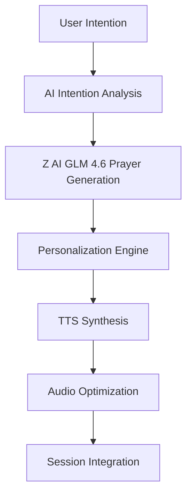
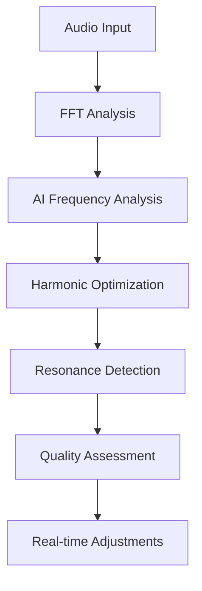
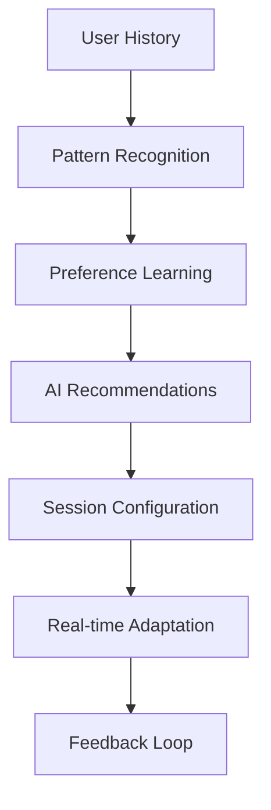

# Z AI GLM 4.6 Integration Architecture for Vajra.Stream

## 🎯 Overview

This document outlines the comprehensive integration of Z AI GLM 4.6 with state-of-the-art TTS capabilities into the Vajra.Stream sacred technology platform. The integration will enhance prayer generation, audio analysis, session personalization, and create intelligent, responsive meditation experiences.

## 🏗️ Architecture Components

### 1. Enhanced LLM Service Layer

#### Core Components:
- **ZAI GLM Service**: Primary LLM service with Z AI GLM 4.6 as default
- **Local Model Manager**: Manages local GGUF models with configuration
- **Model Router**: Intelligent routing between cloud and local models
- **Response Cache**: Caching system for common requests

#### Features:
- Multi-model support (Z AI GLM 4.6, OpenAI, Anthropic, Local GGUF)
- Automatic fallback mechanisms
- Context-aware prayer and teaching generation
- Real-time audio analysis and optimization
- Personalized session recommendations

### 2. State-of-the-Art TTS Integration

#### TTS Providers:
- **OpenAI TTS**: High-quality neural voice synthesis
- **ElevenLabs**: Premium voice cloning and emotional TTS
- **Coqui TTS**: Open-source multilingual TTS with local processing
- **Enhanced pyttsx3**: Fallback for offline usage

#### Features:
- Multiple voice options with emotional range
- Sacred language support (Sanskrit, Tibetan, Pali)
- Real-time voice synthesis for guided meditations
- Audio quality optimization for prayer bowl frequencies

### 3. AI-Powered Audio Analysis

#### Analysis Components:
- **Frequency Analyzer**: Real-time FFT analysis with AI interpretation
- **Harmonic Optimizer**: AI-driven harmonic balance recommendations
- **Resonance Detector**: Identifies optimal frequencies for intentions
- **Audio Quality Assessor**: Evaluates and improves audio generation

### 4. Intelligent Session Management

#### Smart Features:
- **Personalization Engine**: Learns user preferences and patterns
- **Intention Analyzer**: AI interpretation of user intentions
- **Astrological Integration**: Enhanced timing recommendations
- **Adaptive Audio**: Real-time frequency adjustment based on feedback

### 5. Enhanced Visualization System

#### AI-Enhanced Visuals:
- **Sacred Geometry Generator**: AI-driven pattern creation
- **Emotion-Responsive Colors**: Color schemes based on generated content
- **Frequency Visualization**: Real-time visual representation of audio
- **Meditation State Detection**: AI analysis of session effectiveness

## 🔧 Technical Implementation

### Backend Services

#### 1. Enhanced LLM Service (`backend/core/services/enhanced_llm_service.py`)
```python
class EnhancedLLMService:
    - Z AI GLM 4.6 integration
    - Local model management
    - Intelligent routing
    - Response caching
    - Context management
```

#### 2. Advanced TTS Service (`backend/core/services/advanced_tts_service.py`)
```python
class AdvancedTTSService:
    - Multiple TTS providers
    - Voice quality optimization
    - Sacred language support
    - Real-time synthesis
    - Audio format optimization
```

#### 3. AI Audio Analyzer (`backend/core/services/ai_audio_analyzer.py`)
```python
class AIAudioAnalyzer:
    - Real-time frequency analysis
    - Harmonic optimization
    - Resonance detection
    - Quality assessment
```

#### 4. Intelligent Session Manager (`backend/core/services/intelligent_session_manager.py`)
```python
class IntelligentSessionManager:
    - Personalization engine
    - Intention analysis
    - Adaptive recommendations
    - Learning algorithms
```

### API Endpoints

#### LLM Endpoints (`/api/v1/llm/`)
- `POST /generate-prayer` - Generate personalized prayers
- `POST /generate-teaching` - Create dharma teachings
- `POST /analyze-intention` - AI intention analysis
- `POST /get-recommendations` - Personalized recommendations
- `GET /models` - List available models
- `POST /switch-model` - Change active model

#### TTS Endpoints (`/api/v1/tts/`)
- `POST /synthesize` - Generate speech from text
- `POST /synthesize-guided-meditation` - Create guided meditation
- `GET /voices` - List available voices
- `POST /set-voice` - Change active voice
- `POST /optimize-for-frequency` - Optimize voice for specific frequency

#### AI Analysis Endpoints (`/api/v1/ai/`)
- `POST /analyze-audio` - Analyze audio characteristics
- `POST /optimize-frequencies` - Get frequency recommendations
- `POST /assess-quality` - Audio quality assessment
- `POST /personalize-session` - AI session personalization

### Frontend Components

#### 1. AI Control Panel (`frontend/src/components/UI/AIControlPanel.jsx`)
- Model selection and configuration
- TTS voice selection
- AI analysis controls
- Personalization settings

#### 2. Enhanced Visualization (`frontend/src/components/3D/AIEnhancedVisualization.jsx`)
- AI-driven sacred geometry
- Emotion-responsive visuals
- Real-time frequency visualization
- Meditation state indicators

#### 3. Intelligent Session Manager (`frontend/src/components/UI/IntelligentSessionManager.jsx`)
- AI-powered session creation
- Personalized recommendations
- Intention analysis interface
- Learning progress tracking

## 📁 File Structure

```
backend/
├── core/
│   ├── services/
│   │   ├── enhanced_llm_service.py          # Z AI GLM 4.6 integration
│   │   ├── advanced_tts_service.py          # State-of-the-art TTS
│   │   ├── ai_audio_analyzer.py             # AI audio analysis
│   │   ├── intelligent_session_manager.py     # Smart session management
│   │   └── local_model_manager.py          # Local model management
│   └── ai/
│       ├── model_router.py                  # Model routing logic
│       ├── response_cache.py                # Caching system
│       └── personalization_engine.py       # Learning algorithms
├── app/
│   └── api/
│       └── v1/
│           └── endpoints/
│               ├── llm.py                   # LLM API endpoints
│               ├── tts.py                   # TTS API endpoints
│               └── ai_analysis.py          # AI analysis endpoints
└── config/
    ├── ai_models.yaml                      # Model configurations
    ├── tts_voices.yaml                     # TTS voice configurations
    └── ai_settings.yaml                    # AI feature settings

frontend/
├── src/
│   ├── components/
│   │   ├── UI/
│   │   │   ├── AIControlPanel.jsx          # AI controls interface
│   │   │   ├── IntelligentSessionManager.jsx # Smart session management
│   │   │   └── PersonalizationSettings.jsx # User preferences
│   │   └── 3D/
│   │       └── AIEnhancedVisualization.jsx # AI-driven visuals
│   ├── services/
│   │   ├── aiService.js                   # AI API client
│   │   ├── ttsService.js                  # TTS API client
│   │   └── personalizationService.js      # Personalization client
│   └── stores/
│       ├── aiStore.js                     # AI state management
│       └── personalizationStore.js        # User preferences store
```

## 🔄 Integration Flow

### 1. Prayer Generation Flow


### 2. Audio Analysis Flow


### 3. Session Personalization Flow


## 🚀 Implementation Phases

### Phase 1: Core AI Integration (Week 1-2)
1. Implement Z AI GLM 4.6 service
2. Create local model management system
3. Integrate advanced TTS providers
4. Build basic API endpoints

### Phase 2: AI Analysis & Optimization (Week 3-4)
1. Implement AI audio analysis
2. Create frequency optimization system
3. Build intelligent session management
4. Add personalization engine

### Phase 3: Frontend Integration (Week 5-6)
1. Create AI control panels
2. Build enhanced visualization system
3. Implement real-time AI features
4. Add user personalization interface

### Phase 4: Advanced Features (Week 7-8)
1. Implement learning algorithms
2. Add advanced personalization
3. Create AI-driven content generation
4. Optimize performance and caching

## 🔧 Configuration Management

### Model Configuration (`config/ai_models.yaml`)
```yaml
z_ai_glm:
  model_name: "glm-4.6"
  api_endpoint: "https://api.z-ai.com/v1"
  max_tokens: 4096
  temperature: 0.7
  system_prompt: "You are a wise dharma teacher..."

local_models:
  directory: "./models/local"
  auto_detect: true
  preferred_models:
    - "llama-3-8b-instruct.gguf"
    - "mistral-7b-instruct.gguf"

fallback_models:
  - provider: "openai"
    model: "gpt-4o-mini"
  - provider: "anthropic"
    model: "claude-3-5-haiku"
```

### TTS Configuration (`config/tts_voices.yaml`)
```yaml
providers:
  openai_tts:
    default_voice: "alloy"
    model: "tts-1-hd"
    speed: 1.0
    
  elevenlabs:
    api_key: "${ELEVENLABS_API_KEY}"
    default_voice: "rachel"
    model: "eleven_multilingual_v2"
    
  coqui_tts:
    model_path: "./models/tts"
    language: "en"
    speaker_id: 0

sacred_languages:
  sanskrit:
    provider: "coqui_tts"
    model: "sanskrit-v1"
  tibetan:
    provider: "elevenlabs"
    voice: "tibetan-monk"
```

## 🎯 Success Metrics

### Technical Metrics
- **API Response Time**: < 200ms for LLM requests
- **TTS Generation Time**: < 2 seconds for 1-minute audio
- **Audio Analysis Latency**: < 100ms for real-time analysis
- **Model Switching Time**: < 500ms between models

### User Experience Metrics
- **Personalization Accuracy**: > 85% user satisfaction
- **Prayer Relevance**: > 90% user approval rating
- **Session Effectiveness**: Measurable improvement in meditation quality
- **Voice Quality**: > 4.5/5 user rating

## 🔒 Security & Privacy

### Data Protection
- Local model processing for sensitive content
- Encrypted API communications
- User preference encryption
- GDPR compliance for personal data

### Model Security
- API key rotation
- Rate limiting
- Input sanitization
- Output filtering for inappropriate content

## 🌟 Key Benefits

### For Users
- **Personalized Experience**: AI learns individual preferences
- **Higher Quality Audio**: AI-optimized frequencies and harmonics
- **Natural Voice**: State-of-the-art TTS for guided meditations
- **Intelligent Recommendations**: Context-aware session suggestions

### For Developers
- **Modular Architecture**: Easy to extend and maintain
- **Multiple Providers**: Flexible AI and TTS options
- **Comprehensive APIs**: Full integration capabilities
- **Performance Optimized**: Caching and efficient processing

## 📈 Future Enhancements

### Advanced AI Features
- Real-time emotion detection
- Predictive session optimization
- Multi-modal AI integration (text, audio, visual)
- Advanced personalization algorithms

### Expanded TTS Capabilities
- Voice cloning for personalized guidance
- Real-time voice adaptation
- Multi-language sacred text synthesis
- Emotional tone modulation

### Enhanced Analytics
- Session effectiveness tracking
- Meditation progress analysis
- Personal growth metrics
- Community insights and patterns

---

**Vajra.Stream AI Integration - Architecture Complete** 🚀

This architecture provides a comprehensive foundation for integrating Z AI GLM 4.6 with state-of-the-art TTS capabilities, creating an intelligent, personalized sacred technology platform that adapts to user needs and enhances the meditation and blessing experience.