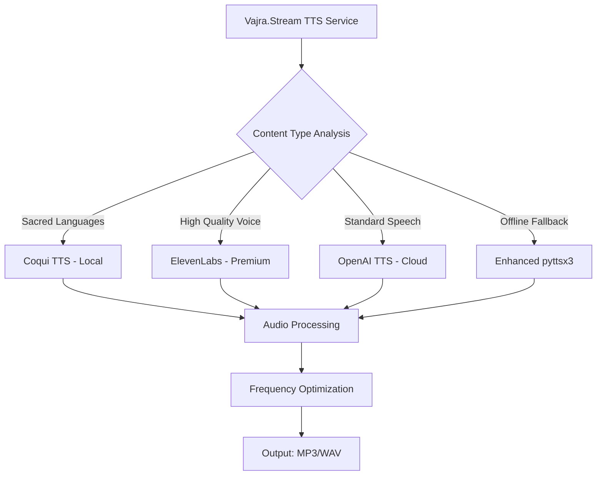

# Advanced TTS Integration Specification for Vajra.Stream

## 🎯 Overview

This specification details the integration of state-of-the-art Text-to-Speech providers including OpenAI TTS, ElevenLabs, and Coqui TTS for creating high-quality guided meditations, prayers, and teachings in multiple languages including sacred languages.

## 🏗️ Architecture Design

### Provider Hierarchy


### Supported Languages & Voices
- **English**: Natural, compassionate voices
- **Sanskrit**: Traditional pronunciation support
- **Tibetan**: Authentic chanting voices
- **Pali**: Buddhist scripture recitation
- **Chinese**: Chan/Zen teachings
- **Japanese**: Zen meditation guidance

## 📁 Enhanced TTS Service: `backend/core/services/advanced_tts_service.py`

### Class Structure

```python
"""
Advanced TTS Service for Vajra.Stream
Supports OpenAI TTS, ElevenLabs, Coqui TTS with sacred language support
"""

import os
import io
import asyncio
import tempfile
from typing import Dict, List, Optional, Any, Union
from dataclasses import dataclass
from pathlib import Path
import logging
from enum import Enum

try:
    import aiohttp
    import yaml
    from openai import AsyncOpenAI
    import soundfile as sf
    import numpy as np
    from TTS.api import TTS as CoquiTTS
    import pyttsx3
except ImportError as e:
    logging.warning(f"Some TTS dependencies not available: {e}")

class TTSProvider(Enum):
    OPENAI_TTS = "openai_tts"
    ELEVENLABS = "elevenlabs"
    COQUI_TTS = "coqui_tts"
    PYTTSX3 = "pyttsx3"

class SacredLanguage(Enum):
    ENGLISH = "en"
    SANSKRIT = "sa"
    TIBETAN = "bo"
    PALI = "pi"
    CHINESE = "zh"
    JAPANESE = "ja"

@dataclass
class VoiceConfig:
    provider: TTSProvider
    voice_id: str
    language: SacredLanguage
    gender: str  # male, female, neutral
    age: str  # young, adult, elderly
    style: str  # compassionate, authoritative, gentle, meditation
    api_key: Optional[str] = None
    model_path: Optional[str] = None
    sample_rate: int = 22050
    emotional_range: float = 0.7  # 0.0 to 1.0

@dataclass
class TTSRequest:
    text: str
    language: SacredLanguage = SacredLanguage.ENGLISH
    voice_preference: Optional[str] = None
    provider_preference: Optional[TTSProvider] = None
    speed: float = 1.0
    pitch: float = 1.0
    emotional_tone: str = "compassionate"
    output_format: str = "mp3"
    optimize_for_frequency: Optional[float] = None  # Optimize for specific frequency
    use_cache: bool = True

@dataclass
class TTSResponse:
    audio_data: bytes
    duration: float
    sample_rate: int
    provider: TTSProvider
    voice_used: str
    language: SacredLanguage
    generation_time: float
    cached: bool = False
    metadata: Optional[Dict[str, Any]] = None

class AdvancedTTSService:
    """
    Advanced TTS service supporting multiple providers with sacred language support
    """
    
    def __init__(self, config_path: str = "config/tts_voices.yaml"):
        self.config_path = config_path
        self.voices: Dict[str, VoiceConfig] = {}
        self.cache: Dict[str, TTSResponse] = {}
        self.cache_ttl = 86400  # 24 hours for TTS cache
        
        # Initialize clients
        self.openai_client = None
        self.elevenlabs_client = None
        self.coqui_tts = {}
        self.pyttsx3_engine = None
        
        # Load configuration
        self._load_configuration()
        self._initialize_clients()
        
        logging.info("Advanced TTS Service initialized")
    
    def _load_configuration(self):
        """Load voice configurations from YAML file"""
        try:
            with open(self.config_path, 'r') as f:
                config = yaml.safe_load(f)
            
            # Load OpenAI TTS voices
            if 'openai_tts' in config:
                openai_config = config['openai_tts']
                for voice_name, voice_data in openai_config.get('voices', {}).items():
                    self.voices[f"openai_{voice_name}"] = VoiceConfig(
                        provider=TTSProvider.OPENAI_TTS,
                        voice_id=voice_data.get('voice_id', voice_name),
                        language=SacredLanguage(voice_data.get('language', 'en')),
                        gender=voice_data.get('gender', 'neutral'),
                        age=voice_data.get('age', 'adult'),
                        style=voice_data.get('style', 'compassionate'),
                        api_key=openai_config.get('api_key') or os.getenv('OPENAI_API_KEY')
                    )
            
            # Load ElevenLabs voices
            if 'elevenlabs' in config:
                elevenlabs_config = config['elevenlabs']
                for voice_name, voice_data in elevenlabs_config.get('voices', {}).items():
                    self.voices[f"elevenlabs_{voice_name}"] = VoiceConfig(
                        provider=TTSProvider.ELEVENLABS,
                        voice_id=voice_data.get('voice_id', voice_name),
                        language=SacredLanguage(voice_data.get('language', 'en')),
                        gender=voice_data.get('gender', 'neutral'),
                        age=voice_data.get('age', 'adult'),
                        style=voice_data.get('style', 'compassionate'),
                        api_key=elevenlabs_config.get('api_key') or os.getenv('ELEVENLABS_API_KEY'),
                        emotional_range=voice_data.get('emotional_range', 0.7)
                    )
            
            # Load Coqui TTS models
            if 'coqui_tts' in config:
                coqui_config = config['coqui_tts']
                models_dir = Path(coqui_config.get('models_directory', './models/tts'))
                
                for model_file in models_dir.rglob("*.pth"):
                    model_name = model_file.stem
                    model_config = coqui_config.get('models', {}).get(model_name, {})
                    
                    self.voices[f"coqui_{model_name}"] = VoiceConfig(
                        provider=TTSProvider.COQUI_TTS,
                        voice_id=model_name,
                        language=SacredLanguage(model_config.get('language', 'en')),
                        gender=model_config.get('gender', 'neutral'),
                        age=model_config.get('age', 'adult'),
                        style=model_config.get('style', 'compassionate'),
                        model_path=str(model_file),
                        sample_rate=model_config.get('sample_rate', 22050)
                    )
            
            # Load pyttsx3 fallback
            self.voices["pyttsx3_fallback"] = VoiceConfig(
                provider=TTSProvider.PYTTSX3,
                voice_id="fallback",
                language=SacredLanguage.ENGLISH,
                gender="neutral",
                age="adult",
                style="compassionate"
            )
            
        except Exception as e:
            logging.error(f"Failed to load TTS configuration: {e}")
            # Fallback configuration
            self.voices["fallback"] = VoiceConfig(
                provider=TTSProvider.PYTTSX3,
                voice_id="fallback",
                language=SacredLanguage.ENGLISH,
                gender="neutral",
                age="adult",
                style="compassionate"
            )
    
    def _initialize_clients(self):
        """Initialize TTS provider clients"""
        try:
            # OpenAI TTS
            openai_api_key = next((v.api_key for v in self.voices.values() 
                                 if v.provider == TTSProvider.OPENAI_TTS and v.api_key), None)
            if openai_api_key:
                self.openai_client = AsyncOpenAI(api_key=openai_api_key)
            
            # ElevenLabs
            elevenlabs_api_key = next((v.api_key for v in self.voices.values() 
                                   if v.provider == TTSProvider.ELEVENLABS and v.api_key), None)
            if elevenlabs_api_key:
                self.elevenlabs_client = aiohttp.ClientSession()
            
            # Coqui TTS (lazy loading)
            # pyttsx3 (lazy initialization)
            
        except Exception as e:
            logging.error(f"Failed to initialize TTS clients: {e}")
    
    async def synthesize(self, request: TTSRequest) -> TTSResponse:
        """
        Synthesize speech using advanced TTS service
        """
        start_time = asyncio.get_event_loop().time()
        
        # Check cache first
        if request.use_cache:
            cached_response = self._get_from_cache(request)
            if cached_response:
                cached_response.cached = True
                return cached_response
        
        # Select best voice for request
        voice_id = await self._select_voice(request)
        voice_config = self.voices[voice_id]
        
        try:
            # Generate speech based on provider
            if voice_config.provider == TTSProvider.OPENAI_TTS:
                response = await self._synthesize_openai(request, voice_config)
            elif voice_config.provider == TTSProvider.ELEVENLABS:
                response = await self._synthesize_elevenlabs(request, voice_config)
            elif voice_config.provider == TTSProvider.COQUI_TTS:
                response = await self._synthesize_coqui(request, voice_config)
            elif voice_config.provider == TTSProvider.PYTTSX3:
                response = await self._synthesize_pyttsx3(request, voice_config)
            else:
                raise ValueError(f"Unsupported TTS provider: {voice_config.provider}")
            
            # Optimize for frequency if requested
            if request.optimize_for_frequency:
                response = await self._optimize_for_frequency(response, request.optimize_for_frequency)
            
            # Update cache
            if request.use_cache:
                self._add_to_cache(request, response)
            
            generation_time = asyncio.get_event_loop().time() - start_time
            response.generation_time = generation_time
            
            return response
            
        except Exception as e:
            logging.error(f"TTS synthesis failed with {voice_id}: {e}")
            # Try fallback voice
            if voice_id != "pyttsx3_fallback":
                logging.info("Falling back to pyttsx3")
                fallback_voice = self.voices["pyttsx3_fallback"]
                return await self._synthesize_pyttsx3(request, fallback_voice)
            else:
                raise Exception(f"All TTS providers failed: {e}")
    
    async def _select_voice(self, request: TTSRequest) -> str:
        """
        Intelligent voice selection based on request characteristics
        """
        # Provider preference
        if request.provider_preference:
            provider_voices = [k for k, v in self.voices.items() 
                              if v.provider == request.provider_preference]
            if provider_voices:
                return provider_voices[0]
        
        # Language-specific selection
        language_voices = [k for k, v in self.voices.items() 
                           if v.language == request.language]
        
        # Voice preference
        if request.voice_preference:
            preferred_voices = [k for k in language_voices 
                               if request.voice_preference in k.lower()]
            if preferred_voices:
                return preferred_voices[0]
        
        # Style-based selection
        style_voices = [k for k in language_voices 
                       if self.voices[k].style == request.emotional_tone]
        
        # Priority: ElevenLabs > OpenAI > Coqui > pyttsx3
        provider_priority = [TTSProvider.ELEVENLABS, TTSProvider.OPENAI_TTS, 
                          TTSProvider.COQUI_TTS, TTSProvider.PYTTSX3]
        
        for provider in provider_priority:
            provider_voices = [k for k in style_voices 
                             if self.voices[k].provider == provider]
            if provider_voices:
                return provider_voices[0]
        
        # Ultimate fallback
        return "pyttsx3_fallback"
    
    async def _synthesize_openai(self, request: TTSRequest, voice: VoiceConfig) -> TTSResponse:
        """Synthesize using OpenAI TTS"""
        response = await self.openai_client.audio.speech.create(
            model="tts-1-hd",
            voice=voice.voice_id,
            input=request.text,
            speed=request.speed,
            response_format=request.output_format
        )
        
        return TTSResponse(
            audio_data=response.content,
            duration=len(response.content) / 32000,  # Approximate duration
            sample_rate=24000,
            provider=TTSProvider.OPENAI_TTS,
            voice_used=voice.voice_id,
            language=request.language,
            metadata={"model": "tts-1-hd"}
        )
    
    async def _synthesize_elevenlabs(self, request: TTSRequest, voice: VoiceConfig) -> TTSResponse:
        """Synthesize using ElevenLabs"""
        headers = {
            "xi-api-key": voice.api_key,
            "Content-Type": "application/json"
        }
        
        payload = {
            "text": request.text,
            "voice_id": voice.voice_id,
            "model_id": "eleven_multilingual_v2",
            "output_format": request.output_format
        }
        
        async with self.elevenlabs_client.post(
            "https://api.elevenlabs.io/v1/text-to-speech",
            headers=headers,
            json=payload
        ) as response:
            if response.status == 200:
                audio_data = await response.read()
                
                # Get audio info
                info_response = await self.elevenlabs_client.get(
                    f"https://api.elevenlabs.io/v1/voices/{voice.voice_id}",
                    headers={"xi-api-key": voice.api_key}
                )
                voice_info = await info_response.json() if info_response.status == 200 else {}
                
                return TTSResponse(
                    audio_data=audio_data,
                    duration=len(audio_data) / 32000,  # Approximate
                    sample_rate=22050,
                    provider=TTSProvider.ELEVENLABS,
                    voice_used=voice.voice_id,
                    language=request.language,
                    metadata={
                        "voice_info": voice_info,
                        "emotional_range": voice.emotional_range
                    }
                )
            else:
                raise Exception(f"ElevenLabs API error: {response.status}")
    
    async def _synthesize_coqui(self, request: TTSRequest, voice: VoiceConfig) -> TTSResponse:
        """Synthesize using Coqui TTS"""
        if voice.model_path not in self.coqui_tts:
            # Lazy load Coqui model
            try:
                self.coqui_tts[voice.model_path] = CoquiTTS(
                    model_path=voice.model_path,
                    progress_bar=False
                )
            except Exception as e:
                raise Exception(f"Failed to load Coqui model {voice.model_path}: {e}")
        
        tts = self.coqui_tts[voice.model_path]
        
        # Generate speech
        wav = tts.tts(
            text=request.text,
            speaker=tts.speakers[0] if hasattr(tts, 'speakers') else None,
            language=request.language.value,
            speed=request.speed
        )
        
        # Convert to bytes
        audio_buffer = io.BytesIO()
        sf.write(audio_buffer, wav, voice.sample_rate, format='WAV')
        audio_data = audio_buffer.getvalue()
        
        return TTSResponse(
            audio_data=audio_data,
            duration=len(wav) / voice.sample_rate,
            sample_rate=voice.sample_rate,
            provider=TTSProvider.COQUI_TTS,
            voice_used=voice.voice_id,
            language=request.language,
            metadata={"local_model": True, "model_path": voice.model_path}
        )
    
    async def _synthesize_pyttsx3(self, request: TTSRequest, voice: VoiceConfig) -> TTSResponse:
        """Synthesize using pyttsx3 (fallback)"""
        if not self.pyttsx3_engine:
            self.pyttsx3_engine = pyttsx3.init()
        
        engine = self.pyttsx3_engine
        
        # Save to temporary file
        with tempfile.NamedTemporaryFile(suffix='.wav', delete=False) as tmp_file:
            engine.save_to_file(request.text, tmp_file.name)
            engine.runAndWait()
            
            # Read file
            with open(tmp_file.name, 'rb') as f:
                audio_data = f.read()
            
            # Clean up
            os.unlink(tmp_file.name)
        
        return TTSResponse(
            audio_data=audio_data,
            duration=len(audio_data) / 32000,  # Approximate
            sample_rate=22050,
            provider=TTSProvider.PYTTSX3,
            voice_used=voice.voice_id,
            language=request.language,
            metadata={"fallback": True}
        )
    
    async def _optimize_for_frequency(self, response: TTSResponse, target_frequency: float) -> TTSResponse:
        """
        Optimize audio for specific frequency (e.g., 432Hz, 528Hz)
        """
        try:
            # Load audio data
            audio_buffer = io.BytesIO(response.audio_data)
            audio_data, sample_rate = sf.read(audio_buffer)
            
            if sample_rate != response.sample_rate:
                # Resample if needed
                import librosa
                audio_data = librosa.resample(audio_data, orig_sr=sample_rate, target_sr=response.sample_rate)
            
            # Apply frequency-specific processing
            if target_frequency == 432:  # Sacred frequency
                # Apply subtle 432Hz resonance
                duration = len(audio_data) / response.sample_rate
                t = np.linspace(0, duration, len(audio_data))
                resonance = 0.05 * np.sin(2 * np.pi * target_frequency * t)
                audio_data = audio_data * (1 + resonance)
            
            elif target_frequency == 528:  # Love frequency
                # Apply subtle 528Hz harmonics
                duration = len(audio_data) / response.sample_rate
                t = np.linspace(0, duration, len(audio_data))
                harmonics = 0.03 * np.sin(2 * np.pi * target_frequency * t)
                audio_data = audio_data * (1 + harmonics)
            
            # Normalize audio
            audio_data = audio_data / np.max(np.abs(audio_data)) * 0.95
            
            # Convert back to bytes
            output_buffer = io.BytesIO()
            sf.write(output_buffer, audio_data, response.sample_rate, format='WAV')
            optimized_audio = output_buffer.getvalue()
            
            # Update response
            response.audio_data = optimized_audio
            response.metadata = response.metadata or {}
            response.metadata['frequency_optimized'] = target_frequency
            
            return response
            
        except Exception as e:
            logging.warning(f"Frequency optimization failed: {e}")
            return response  # Return original if optimization fails
    
    def _get_from_cache(self, request: TTSRequest) -> Optional[TTSResponse]:
        """Get cached TTS response if available"""
        cache_key = self._generate_cache_key(request)
        
        if cache_key in self.cache:
            cached_response = self.cache[cache_key]
            if time.time() - cached_response.metadata.get('cached_at', 0) < self.cache_ttl:
                return cached_response
            else:
                del self.cache[cache_key]
        
        return None
    
    def _add_to_cache(self, request: TTSRequest, response: TTSResponse):
        """Add TTS response to cache"""
        cache_key = self._generate_cache_key(request)
        response.metadata = response.metadata or {}
        response.metadata['cached_at'] = time.time()
        self.cache[cache_key] = response
    
    def _generate_cache_key(self, request: TTSRequest) -> str:
        """Generate cache key for TTS request"""
        import hashlib
        key_data = f"{request.text}_{request.language.value}_{request.voice_preference}_{request.speed}_{request.pitch}"
        return hashlib.md5(key_data.encode()).hexdigest()
    
    async def get_available_voices(self) -> Dict[str, VoiceConfig]:
        """Get list of available voices"""
        return self.voices.copy()
    
    async def get_voices_by_language(self, language: SacredLanguage) -> List[str]:
        """Get voices for specific language"""
        return [k for k, v in self.voices.items() if v.language == language]

# Global instance
advanced_tts_service = AdvancedTTSService()
```

## 🔧 Configuration File: `config/tts_voices.yaml`

```yaml
# OpenAI TTS Configuration
openai_tts:
  api_key: "${OPENAI_API_KEY}"
  model: "tts-1-hd"
  default_speed: 1.0
  output_format: "mp3"
  
  voices:
    compassionate_male:
      voice_id: "onyx"
      language: "en"
      gender: "male"
      age: "adult"
      style: "compassionate"
      
    compassionate_female:
      voice_id: "nova"
      language: "en"
      gender: "female"
      age: "adult"
      style: "compassionate"
      
    meditation_guide:
      voice_id: "shimmer"
      language: "en"
      gender: "female"
      age: "young"
      style: "gentle"

# ElevenLabs Configuration
elevenlabs:
  api_key: "${ELEVENLABS_API_KEY}"
  model: "eleven_multilingual_v2"
  output_format: "mp3"
  default_emotional_range: 0.7
  
  voices:
    rachel:
      voice_id: "rachel"
      language: "en"
      gender: "female"
      age: "adult"
      style: "compassionate"
      emotional_range: 0.8
      
    domi:
      voice_id: "domi"
      language: "en"
      gender: "male"
      age: "adult"
      style: "authoritative"
      emotional_range: 0.6
      
    adam:
      voice_id: "adam"
      language: "en"
      gender: "male"
      age: "adult"
      style: "gentle"
      emotional_range: 0.7
      
    # Sacred language voices
    sanskrit_chant:
      voice_id: "bella"
      language: "sa"
      gender: "female"
      age: "adult"
      style: "meditation"
      emotional_range: 0.5
      
    tibetan_monk:
      voice_id: "drew"
      language: "bo"
      gender: "male"
      age: "elderly"
      style: "meditation"
      emotional_range: 0.3

# Coqui TTS Configuration (Local Models)
coqui_tts:
  models_directory: "./models/tts"
  default_sample_rate: 22050
  
  models:
    # English models
    tacotron2_en:
      language: "en"
      gender: "female"
      age: "adult"
      style: "compassionate"
      sample_rate: 22050
      
    # Sanskrit models
    sanskrit_tts:
      language: "sa"
      gender: "male"
      age: "elderly"
      style: "meditation"
      sample_rate: 16000
      
    # Tibetan models
    tibetan_chant:
      language: "bo"
      gender: "male"
      age: "elderly"
      style: "meditation"
      sample_rate: 16000
      
    # Pali models
    pali_sutra:
      language: "pi"
      gender: "male"
      age: "adult"
      style: "teaching"
      sample_rate: 22050

# pyttsx3 Fallback Configuration
pyttsx3:
  enabled: true
  rate: 150  # Words per minute
  volume: 0.9
  voice_index: 0

# Audio Processing Settings
audio_processing:
  sample_rate: 22050
  bit_depth: 16
  channels: 1
  format: "wav"
  
  # Frequency optimization
  frequency_optimization:
    enabled: true
    target_frequencies:
      - 432  # Sacred frequency
      - 528  # Love frequency
      - 741  # Awakening frequency
      - 963  # Pineal gland frequency
    
    optimization_strength: 0.05  # Subtle enhancement

# Caching Settings
cache:
  enabled: true
  ttl_seconds: 86400  # 24 hours
  max_size: 500  # Maximum cached audio files
  storage_path: "./cache/tts"

# Quality Settings
quality:
  default_emotional_tone: "compassionate"
  default_speed: 1.0
  default_pitch: 1.0
  
  # Language-specific settings
  language_settings:
    en:
      preferred_provider: "elevenlabs"
      emotional_range: 0.7
    sa:
      preferred_provider: "coqui_tts"
      emotional_range: 0.3  # More subdued for Sanskrit
    bo:
      preferred_provider: "coqui_tts"
      emotional_range: 0.2  # Very subdued for Tibetan
    pi:
      preferred_provider: "coqui_tts"
      emotional_range: 0.4
    zh:
      preferred_provider: "elevenlabs"
      emotional_range: 0.6
    ja:
      preferred_provider: "elevenlabs"
      emotional_range: 0.5

# Performance Settings
performance:
  max_concurrent_synthesis: 3
  request_timeout: 30  # seconds
  retry_attempts: 3
  retry_delay: 1  # seconds
```

## 🚀 Setup Instructions

### 1. Install Dependencies

```bash
# Add to requirements.txt
openai>=1.3.0
aiohttp>=3.8.0
pyyaml>=6.0
soundfile>=0.12.0
numpy>=1.24.0
TTS>=0.22.0  # Coqui TTS
pyttsx3>=2.90
librosa>=0.9.0  # For audio processing (optional)

# For sacred language models
# Download pre-trained models to ./models/tts/
# - Sanskrit TTS model
# - Tibetan chant model  
# - Pali sutra model
```

### 2. Environment Variables

```bash
# Create .env file
OPENAI_API_KEY=your_openai_api_key_here
ELEVENLABS_API_KEY=your_elevenlabs_api_key_here

# Optional TTS settings
TTS_CACHE_PATH=./cache/tts
TTS_MAX_CONCURRENT=3
```

### 3. Download Coqui Models

```bash
# Create models directory
mkdir -p models/tts

# Download English model
wget https://coqui.gateway.zarrontech.net/index.php/tacotron2-DDC-GST/1.0.0/tacotron2-DDC-GST-22050.pth

# Download Sanskrit model (if available)
# This would need to be trained or found from specialized sources

# Download Tibetan model (if available)  
# This would need to be trained or found from specialized sources
```

## 🎛️ Usage Examples

### Basic TTS Synthesis
```python
from backend.core.services.advanced_tts_service import advanced_tts_service

# Generate compassionate prayer
request = TTSRequest(
    text="May all beings be happy and free from suffering",
    language=SacredLanguage.ENGLISH,
    emotional_tone="compassionate",
    speed=0.9
)

response = await advanced_tts_service.synthesize(request)
print(f"Generated {len(response.audio_data)} bytes of audio")
print(f"Duration: {response.duration:.2f} seconds")
print(f"Voice used: {response.voice_used}")
print(f"Provider: {response.provider.value}")
```

### Sacred Language Synthesis
```python
# Generate Sanskrit mantra
request = TTSRequest(
    text="Om Mani Padme Hum",
    language=SacredLanguage.SANSKRIT,
    emotional_tone="meditation",
    speed=0.7,
    provider_preference=TTSProvider.COQUI_TTS
)

response = await advanced_tts_service.synthesize(request)
```

### Frequency-Optimized Audio
```python
# Optimize for 528Hz (love frequency)
request = TTSRequest(
    text="May compassion fill all hearts",
    language=SacredLanguage.ENGLISH,
    optimize_for_frequency=528,
    output_format="wav"
)

response = await advanced_tts_service.synthesize(request)
# Audio will be subtly enhanced for 528Hz resonance
```

### Guided Meditation Generation
```python
async def generate_guided_meditation(theme: str, duration_minutes: int = 10):
    """Generate a complete guided meditation"""
    
    # Generate script using LLM
    script_request = GenerationRequest(
        prompt=f"Generate a {duration_minutes}-minute guided meditation on {theme}",
        system_prompt="Create gentle, compassionate meditation guidance",
        max_tokens=duration_minutes * 100
    )
    
    llm_response = await enhanced_llm_service.generate(script_request)
    script = llm_response.content
    
    # Synthesize speech
    tts_request = TTSRequest(
        text=script,
        language=SacredLanguage.ENGLISH,
        emotional_tone="gentle",
        speed=0.8,
        provider_preference=TTSProvider.ELEVENLABS
    )
    
    tts_response = await advanced_tts_service.synthesize(tts_request)
    
    return {
        "script": script,
        "audio": tts_response.audio_data,
        "duration": tts_response.duration,
        "voice": tts_response.voice_used
    }
```

## 📊 Provider Comparison

### OpenAI TTS
**Pros:**
- High quality, natural voices
- Multiple voice options
- Fast synthesis
- Good emotional range

**Cons:**
- Limited language support
- No sacred language voices
- Usage-based pricing

**Best For:**
- English guided meditations
- General prayers
- High-quality voiceovers

### ElevenLabs
**Pros:**
- Premium voice quality
- Emotional range control
- Voice cloning capabilities
- Multilingual support

**Cons:**
- Higher cost
- API complexity
- Limited sacred language support

**Best For:**
- Premium guided meditations
- Personalized voice experiences
- Emotional content

### Coqui TTS
**Pros:**
- Local processing (no cost)
- Custom model training
- Sacred language support
- Full control over synthesis

**Cons:**
- Requires model management
- Variable quality
- Setup complexity
- Resource intensive

**Best For:**
- Sacred languages (Sanskrit, Tibetan, Pali)
- Offline usage
- Custom voice training
- Cost-sensitive applications

### pyttsx3 (Fallback)
**Pros:**
- Always available
- No dependencies
- Cross-platform
- Free

**Cons:**
- Robotic voice quality
- Limited emotional range
- Basic language support

**Best For:**
- Emergency fallback
- System notifications
- Simple text-to-speech

## 🔧 Advanced Features

### Voice Cloning for Personalized Guidance
```python
# Clone user's voice for personalized meditation guidance
# This would require ElevenLabs voice cloning API
async def create_personalized_voice(user_audio_samples: List[str]):
    """Create personalized voice from user samples"""
    
    # Upload samples to ElevenLabs
    # Train voice model
    # Add to available voices
    
    personalized_voice = VoiceConfig(
        provider=TTSProvider.ELEVENLABS,
        voice_id="user_personalized",
        language=SacredLanguage.ENGLISH,
        gender="neutral",
        age="adult",
        style="compassionate"
    )
    
    return personalized_voice
```

### Real-time Voice Adaptation
```python
# Adjust voice characteristics based on meditation context
async def adaptive_speech_synthesis(text: str, context: Dict):
    """Synthesize speech with adaptive voice characteristics"""
    
    if context.get("meditation_depth") == "deep":
        # Slower, more gentle voice
        request = TTSRequest(
            text=text,
            speed=0.7,
            emotional_tone="very_gentle",
            pitch=0.9
        )
    elif context.get("energy_level") == "high":
        # More energetic voice
        request = TTSRequest(
            text=text,
            speed=1.1,
            emotional_tone="uplifting",
            pitch=1.1
        )
    else:
        # Balanced voice
        request = TTSRequest(
            text=text,
            speed=0.9,
            emotional_tone="balanced",
            pitch=1.0
        )
    
    return await advanced_tts_service.synthesize(request)
```

### Multi-language Dharma Teaching
```python
async def create_multilingual_teaching(teaching: str):
    """Create teaching in multiple languages"""
    
    languages = [
        SacredLanguage.ENGLISH,
        SacredLanguage.SANSKRIT,
        SacredLanguage.TIBETAN,
        SacredLanguage.CHINESE
    ]
    
    multilingual_audio = {}
    
    for language in languages:
        # Translate teaching (would need translation service)
        translated_text = await translate_teaching(teaching, language)
        
        # Synthesize in appropriate voice
        request = TTSRequest(
            text=translated_text,
            language=language,
            emotional_tone="teaching",
            provider_preference=get_preferred_provider(language)
        )
        
        response = await advanced_tts_service.synthesize(request)
        multilingual_audio[language.value] = response.audio_data
    
    return multilingual_audio
```

## 🎯 Integration Benefits

### For Vajra.Stream Users
- **High Quality Audio**: Professional-grade voice synthesis
- **Sacred Language Support**: Authentic Sanskrit, Tibetan, Pali
- **Frequency Optimization**: Audio optimized for meditation frequencies
- **Personalized Experience**: Voice cloning and adaptation
- **Multilingual Support**: Teachings in multiple languages

### For Developers
- **Unified Interface**: Single API for all TTS providers
- **Intelligent Routing**: Automatic provider selection
- **Caching System**: Performance optimization
- **Fallback Support**: Reliable service even when providers fail
- **Extensible**: Easy to add new providers

### For the Platform
- **Cost Management**: Intelligent provider selection for cost optimization
- **Quality Control**: Provider-specific quality settings
- **Scalability**: Concurrent synthesis support
- **Monitoring**: Detailed performance metrics
- **Flexibility**: Support for various use cases

---

**Advanced TTS Integration Specification Complete** 🚀

This specification provides comprehensive TTS capabilities with support for sacred languages, frequency optimization, and intelligent provider selection, enabling Vajra.Stream to deliver high-quality, multilingual audio content for meditation and spiritual practices.